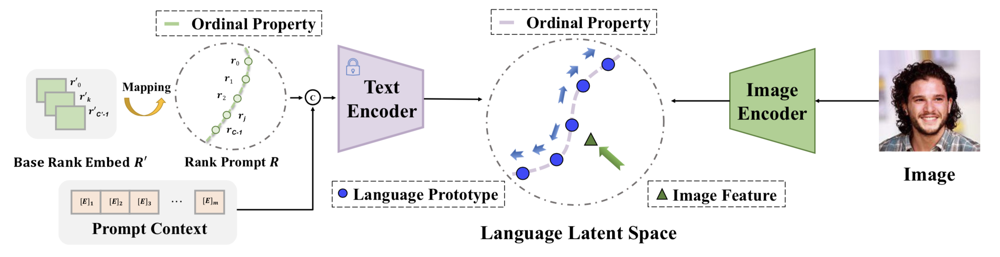

# OrdinalCLIP

Created by [Wanhua Li](https://raoyongming.github.io/)\*, [Xiaoke Huang](https://xk-huang.github.io/)\*, [Zheng Zhu](http://www.zhengzhu.net/), [Yansong Tang](https://andytang15.github.io/), [Xiu Li](https://scholar.google.com/citations?hl=zh-CN&user=Xrh1OIUAAAAJ&view_op=list_works&sortby=pubdate), [Jiwen Lu](https://scholar.google.com/citations?user=TN8uDQoAAAAJ&hl=en&authuser=1)†, [Jie Zhou](https://scholar.google.com/citations?user=6a79aPwAAAAJ&hl=en&authuser=1)

This repository contains PyTorch implementation of "OrdinalCLIP: Learning Rank Prompts for Language-Guided Ordinal Regression".



[[Project Page]](https://xk-huang.github.io/OrdinalCLIP/)
[[arXiv]](https://arxiv.org/abs/2206.02338)
[[Zhihu]](https://zhuanlan.zhihu.com/p/565034693)

## Prerequisite  

### Clone repository

```bash
git clone --recursive https://github.com/xk-huang/OrdinalCLIP.git
```

### Dataset

Download links: [[Google Drive]](https://drive.google.com/drive/folders/1pXDa1iLvG_veewtrvpqayOA7mtkUWJYr?usp=sharing) [[Baidu Drive]](https://pan.baidu.com/s/1RSYSx8tP7M4grUeVfuUhvQ?pwd=k44w)

Download data and save them to `data/MORPH` according to the config files.

### Checkpoint

Download checkpoints (Pytorch/CLIP/Custom) and save them to `.cache/` accordingly.

Weights download links: [[Google Drive]](https://drive.google.com/drive/folders/1pXDa1iLvG_veewtrvpqayOA7mtkUWJYr?usp=sharing) [[Baidu Drive]](https://pan.baidu.com/s/1RSYSx8tP7M4grUeVfuUhvQ?pwd=k44w)

```
.cache
├── clip
│   ├── RN50.pt
│   └── ViT-B-16.pt
├── resnet
│   └── resnet50_imagenet.pt
└── vgg
    ├── vgg16_imagenet.pt
    └── vgg_imdb_wiki.pt
```

## Installation

There are two options to set up environment. 
> Recommend Docker environment.

### Docker Environment

<details>
  <summary>[Docker installation guideline]</summary>

---

1. Install Docker:
    1. Ubuntu >= 18.04: https://docs.docker.com/engine/install/ubuntu/
    2. Ubuntu == 16.04: https://www.digitalocean.com/community/tutorials/how-to-install-and-use-docker-on-ubuntu-16-04
2. Then install nvidia-docker: https://docs.nvidia.com/datacenter/cloud-native/container-toolkit/install-guide.html#setting-up-nvidia-container-toolkit

---

</details>

```bash
docker build -t ordinalclip:latest .
```

### Local Environment
By `.yaml` file:

```bash
conda env create -f environment.yaml
conda activate ordinalclip
pip install -r requirements.txt
# git submodule update --init # git submodule add git@github.com:openai/CLIP.git
pip install -e CLIP/
pip install -e .
```

Or manually install:

```bash
conda create --name ordinalclip python=3.8
conda activate ordinalclip
conda install pytorch==1.10.1 torchvision==0.11.2 cudatoolkit=11.3 -c pytorch -c conda-forge
pip install -r requirements.txt
# git submodule update --init # git submodule add git@github.com:openai/CLIP.git
pip install -e CLIP/
pip install -e .
# pip install setuptools==59.5.0 # https://github.com/pytorch/pytorch/pull/69904
```

For dev:

```bash
pip install bandit==1.7.0 black==22.3.0 flake8-docstrings==1.6.0 flake8==3.9.1 flynt==0.64 isort==5.8.0 mypy==0.902 pre-commit==2.13.0 pytest ipython
pre-commit install
```

## Usage

<details>
  <summary>[If you run scripts in docker, click me]</summary>

---

Start Docker container

```bash
docker run -itd --gpus all \
  -v $(realpath .cache/):/workspace/OrdinalCLIP/.cache \
  -v $(realpath data/):/workspace/OrdinalCLIP/data \
  -v $(realpath results/):/workspace/OrdinalCLIP/results \
  -v $(realpath configs/):/workspace/OrdinalCLIP/configs \
  --name ordinalclip \
  --shm-size 8gb \
  ordinalclip bash
docker exec -it ordinalclip bash
# In the container, run `python ...`
```

After running, remove container and release resources:

```bash
exit # or Ctrl^D
docker rm -f ordinalclip
```

---

</details>

Single-run mode:

```bash
python scripts/run.py --config configs/default.yaml --config configs/base_cfgs/*.yml --config ...
```

Multi-run mode:

```bash
python scripts/experiments/meta_config_generator.py -c $meta_config_file
python scripts/experiments/config_sweeper.py --max_num_gpus_used_in_parallel 8 --num_jobs_per_gpu 1 -d $sweep_config_dir 
```

Visualizing and quantifying ordinality:

```bash
CUDA_VISIBLE_DEVICES=-1 find results/ -name 'config.yaml' -exec python scripts/vis_ordinality.py -c {} \;
```

Parsing results:

```bash
python scripts/experiments/parse_results.py -d $result_dir -p 'test_stats.json'
python scripts/experiments/parse_results.py -d $result_dir -p 'ordinality.json'
# or
python scripts/experiments/parse_results.py -T <(find -name 'test_stats.json') -p 'test_stats.json'
python scripts/experiments/parse_results.py -T <(find -name 'ordinality.json') -p 'ordinality.json'
```

## Experiments Structure

Each experiment has its own name, with several config component names split by `"_"`.
The experiment folder includes:

- `ckpt/`: checkpoints
- `*_logger/`: the logs from `pytorch_lightning`
- `config.yaml`: config
- `run.log`: log the status of model during running
- `val/test_stats.json`: metrics to be parsed
- `val/val_stats.json`: metrics to be parsed
- `val/ordinality.json`: metrics to be parsed

## Training and Evaluation Logs

Please check out releases: https://github.com/xk-huang/OrdinalCLIP/releases/tag/train_eval_logs

## The Code Structure

<details>
  <summary> Structure of the Codebase (click to expand) </summary>

### Structure of ordinalclip

- ordinalclip

  - models
    attributes: image_encoder (torchvision model: fp32, CLIP image encoder: fp16), text_encoder (float32, but layer norm are computed in float32), all converted to float32
    - prompt learner
      - plain prompt learner
        args: num_ranks, num_tokens_per_rank, num_tokens_for_context, rank_tokens_position, init_rank_path, init_context, rank_specific_context
        attributes: context_embeds, rank_embeds, pseudo_sentence_tokens,
      - rank prompt learner (inherited from plain prompt learner)
        args: num_ranks, num_tokens_per_rank, num_tokens_for_context, rank_tokens_position, init_rank_path, init_context, rank_specific_context,interpolation_type
        attributes: weights for interpolation
  - runner
    - runner: A wrapper using pl.LightningModule, defines: loss_computation, metrics computation, create_optimizer, lr_scheduler
    - data: pl.LightningDataModule
    - utils: model io, parameter (un)freeze
  - utils
    - logging & registry from MMCV

- scripts

  - run.py
    To prepare args, use OmegaConf,
    logging and wandb logger,
    train/val/test dataloader,
    model (runner),
    setup trainer

- configs

</details>

## License

MIT License

## Acknowledgement

Many thanks to the following repositories:

- [CoOp](https://github.com/KaiyangZhou/CoOp), [CLIP](https://github.com/openai/CLIP), [PyTorch Lightning](https://github.com/Lightning-AI/lightning), [MMCV](https://github.com/open-mmlab/mmcv), [MMDetection](https://github.com/open-mmlab/mmdetection)

## Citation

If you find this codebase helpful, please consider to cite:

```
@article{Li2022OrdinalCLIP,
  title={OrdinalCLIP: Learning Rank Prompts for Language-Guided Ordinal Regression},
  author={Wanhua Li and Xiaoke Huang and Zheng Zhu and Yansong Tang and Xiu Li and Jiwen Lu and Jie Zhou},
  journal={ArXiv},
  year={2022},
  volume={abs/2206.02338}
} 
```
